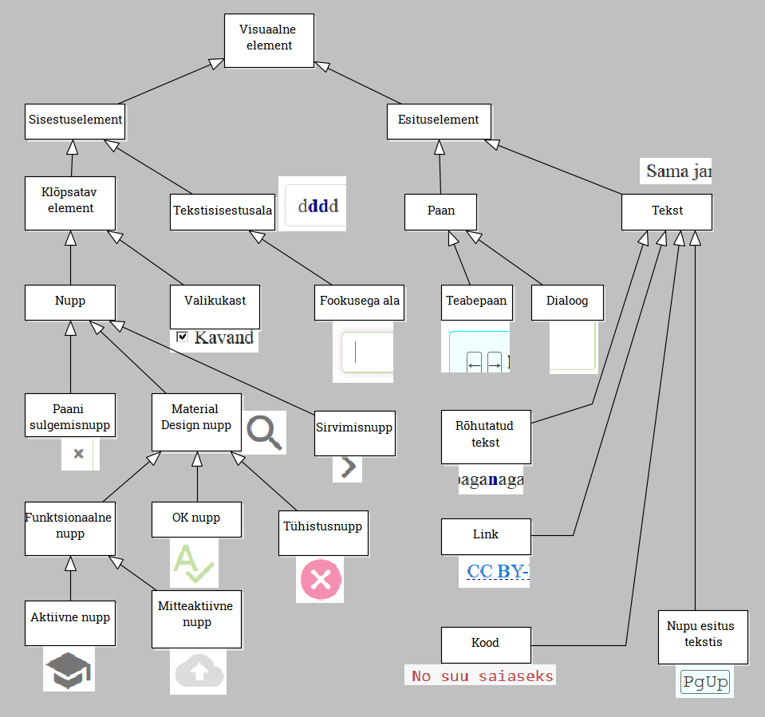

# Samatekstiredaktori arendajale 
{: .no_toc}

Samatekstide (palindroomide) veebiredaktor ja pilves hoitav tekstikogu

Priit Parmakson, 2017

Repo: [https://priitparmakson.github.io/Samatekst/](https://priitparmakson.github.io/Samatekst/)

arendusdokument

- TOC
{:toc}

## Koodistatistika

|  komponent                                 | SLOC (sh tühiread) |
|----------------------------------------|---------------|
| klient (HTML, CSS, Javascript) | 1600  |
| server (Google Apps Script) | 70  |
| testimine (HTML, CSS, Javascript) | 300  |
| dokumentatsioon (Markdown) | 210  |
| dokumentatsioonikeskkond (Jekyll) | 160  |
 
Statistika moodustamine: `wc -l $(git ls-files)`

##  Kasutatud

* Map of keycodes to human readable key names - https://github.com/micro-js/keycodes

## Featuurid

- Samateksti sisestamine
  - Programm kontrollib jooksvalt teksti õigsust...
  - ... ja lisab ise peegeltähed.
  - Tekst võib sisaldada kirjavahemärke.
  - Teksti saab kustutada.
  - Tekstis saab liikuda ja kursorit seada.
  - Tekstisisestusalasse saab teksti asetada (Ctrl+V).  <span class='todo'>TO DO</span>
  - Kesktäht (-tähed) kuvatakse rõhutatult.
  - Samateksti pooled saab vahetada.
  - Saab alustada uut samateksti.
  - Teksti saab salvestada pilvemällu.
    - salvestamisel saab märkida, kas tekst on kavand.
- Samatekstilisuse kontroll
  - Eraldi saab kontrollida, kas tekst on samatekst
- Tekstikogu
  - Saab lehitseda salvestatud tekste.
  - Salvestatud tekste saab otsida.
    - tähekombinatsiooni sisaldumise järgi
    - kesktähe kaudu.
- Infopaanil pakutakse väikest abiteksti.
- "Kool"
  - Kasutaja saab tutvuda samateksti "teooriaga"
    - määratlused
    - samatekstide kombineerimise meetodid.

## Teksti esitusvormingud

```
Esitus teksti-     (1)
sisestusalal   +------->  Siseesitus
     ^                         +
     |                     +   |
     | (2)                 |   |
     +           (2)       |   | (3)
    HTML   <---------------+   |
                               |
                               v
    HTML    <------------+ Pilveesitus
     +           (4)
     |
     | (4)
     v
 Tekstikogu
 esitus

```

(1) kasutaja sisestab tekstisisestusalal; klahvivajutused püütakse sündmuste `keydown` ja `keypress` abil kinni, filtreeritakse (lubatud tähed ja kirjavahemärgid), tehakse kindlaks kursori (ingl _caret_) asukoht. Sisestatavat teksti hoitakse sisekujul.

(2) Tähe lisamisel lisab programm automaatselt peegeltähe ja uuendab tekstisisestusalal olevat teksti. 

(3) Kasutaja saab teksti salvestada. Programm teisendab salvestatava teksti pilveesitusse.

(4) Salvestatud tekste saab sirvida ja otsida. Salvestatud tekstid esitatakse kuval HTML abil.

### Siseesitus  
* Sisemiselt hoitakse kesktähte alati kahekordselt. Teavet kesktähe kordsuse kohta hoiab globaalne muutuja `kuvaKeskelementYhekordselt`.
* Samuti hoitakse siseesituses kursori positsiooni (sümbol `|`).
* Reavahetus hoitakse sümboliga `⏎`.

Näiteks: `IT⏎⏎|Säh, hästi! `

`Samma|s` tähendab `Samas`, kui `kuvaKeskelementYhekordselt` = `true`

### Esitus tekstisisestusalal 

Nähtav:

`IT⏎⏎|Säh, hästi! `

`|` - tühitekst

* Kesktäht (või -tähed) esitatakse rõhutatult.
* Reavahetus esitatakse sümboliga `⏎`.
* Kuvatakse HTML-esituse abil.
  * Kuval esitatav tekst on jagatud viie `span`-elemendi vahel (võivad olla tühjad): `A`, `K1`, `Kt`, `K2`, `B`.
  * Tühiteksti puhul pannakse esimesse `span`-elementi (`A`) 0-pikkusega tühik (`&#8203;`), seda selleks, et tekstisisestusala `div`-element ei kollapseeruks.

Näited:

`<span id='A'>IT⏎⏎Sä</span><span id='K1' class='kesk'>h</span><span id='Kt' class='kesk'>, </span><span id='K2'>h</span><span id='B'>ästi!</span>`

`<span id='A'>&#8203;</span><span id='K1'></span><span id='Kt'></span><span id='K2'></span><span id='B'></span>` - tühiteksti esitamine 0-pikkusega tühiku abil

### Esitus tekstikogus

Näide:

```
IT

Säh, hästi!
```

* Kuval esitatakse kesktäht (või -tähed) rõhutatult.
* Reavahetus teostatakse, `<br>`-elemendi abil.
* Kuvatakse HTML-esituse abil. Näide:

`<span id='A'>IT<br><br>Sä</span><span id='K1' class='kesk'>h</span><span id='Kt' class='kesk'>, </span><span id='K2'>h</span><span id='B'>ästi!</span>`

### Esitus pilvemälus
* Ühekordne kesktäht esitatakse ühekordselt
* Reavahetus hoitakse sümboliga `⏎`. Näide:

`IT⏎⏎Säh, hästi! `
 
## Tekstikogu
* Tekstid kuvatakse nummerdatult.
* Salvestamine
    * Toimub väikeses dialoogis, kus kontrollitakse, kas ikka tahetakse salvestada ja soovi korral määratakse, kas tekst on kavand. Salvestusdialoog on modaalse olemusega.
    * Salvestatakse Google Sheet-le, kasutades Google Sheets REST API-t.
    * Pilve salvestatakse puhta tekstina (rõhutusteta, kesktäht ühekordselt, kui nii on määratud).
* Filtri- e otsidialoog
  * Võib olla avatud samaaegselt teksti sisestuse alaga, kuna tekstisisestussündmusi püütakse tekstisisestusalas.
  * Filtreerimisel ei jagata väljundit lehekülgedeks.
* Turvalisus
    * Injection-ründe kaitse. Google Sheet-iga seotud serverirakenduses (Google Apps Script-is) kontrollitakse üle, et tekst ei sisalda HTML-i.
    * samuti kontrollitakse API poolel, et HTTP POST-päringuga salvestamiseks saadetud tekst on tõesti samatekst. <span class='todo'>TO DO</span>
  
## Logimine
* Logitakse:
    * tekstiredigeerimist (elemendis `Tekst`)
      * nii kasutaja klahvivajutusi
      * kui ka programmi poolt väljastatud teksti
    * filtri seadmist (otsistring + piiravad tingimused)
* Tekstisisestuse logimine
    * Logiteade moodustatakse ühes kahest funktsioonist:
      * `lisaTahtVoiPunktuatsioon`
      * `tootleEriklahv`
    * Logiteade 1: `Kasutaja: ` + klahvinimetus või tärk + caret tuvastatud positsioon tekstisisestusalas + tuvastatud caret positsiooni järgi seatud sisekursor.
  * Tekstiväljastuse logimine
    * Logiteade 2: `Programm: ` + väljastatud tekst + seatud caret positsioon.
    * Logiteade koostatakse funktsioonis `kuvaTekst`
  * Logitasemed:
    * `0` - logitakse tekstisisestus ja -väljastus
    * `1` - logitakse `keydown` ja `keypress` sündmused 

## Testimine
* Funktsioonitestimise automatiseerimiseks on leht `SamasTest.html`; testid pannakse kirja failis `SamasTest.js`.

## Tähtsamad funktsioonid
* Kasutaja tegevused elemendis `Tekst` püütakse kinni sündmustega `keydown` ja `keypress`,
* kust suunatakse tähtede ja punktuatsioonisümbolite töötlemisele (`lisaTahtVoiPunktuatsioon`) või eriklahvivajutuste töötlemisele (`tootleEriklahv`).
* HTML kujule teisendavad `markeeriTekst` ja `markeeriTekstikoguTekst`.
* Tekstisisestusala _caret_ positsiooni tuvastavad ja seavad `tuvastaCaretJaSeaSisekursor` ja `seaCaret`.

## Töövahendid
* Javascripti süntaksikontrollija: [http://esprima.org/demo/validate.html](http://esprima.org/demo/validate.html)
* HTML validaator: [https://validator.w3.org/nu/#file](https://validator.w3.org/nu/#file) (Firefox-i kontekstimenüüst )

## Teave
* Kõigi HTML veebi-API-de nimekiri: [https://developer.mozilla.org/en-US/docs/Web/](https://developer.mozilla.org/en-US/docs/Web/)
* HTML sündmuste kohta: [https://www.w3schools.com/tags/ref_eventattributes.asp](https://www.w3schools.com/tags/ref_eventattributes.asp)
* JQuery sündmusekäsitlejate seadmine: [https://www.w3schools.com/jquery/jquery_events.asp](https://www.w3schools.com/jquery/jquery_events.asp)
* DOM `Node` objekt: [https://www.w3schools.com/xml/dom_node.asp](https://www.w3schools.com/xml/dom_node.asp)
* jQuery-ga tippudele ligipääsemine: [https://api.jquery.com/get/](https://api.jquery.com/get/)

## Sündmused
* Tähesisestuse töötlemiseks on `keypress` parem kui `keydown`, sest `keypress` näitab, milline tärk sisestati (eristab suur- ja väiketähti). `keydown` näitab millist klahvi vajutati.
* Väga hea seletus: [http://stackoverflow.com/questions/1367700/whats-the-difference-between-keydown-and-keypress-in-net](http://stackoverflow.com/questions/1367700/whats-the-difference-between-keydown-and-keypress-in-net)

## Nuppude töötlus
* Kasutajaliidese alade peitmiseks `style='display: none;'`; nähtavale toomine ja peitmine vastavalt JQuery `show`, `hide` ja `toggle`.
* Nuppude mitteaktiivseks tegemine klassiga `disabled`.

## Miks ei kasuta input elementi
* `Input` elemendis vt: setSelectionRange() HTML veebi-APIs HTMLInputElement - https://developer.mozilla.org/en-US/docs/Web/API/HTMLInputElement/setSelectionRange
* JQuery-s ei ole `oninput` võimalust, vt
   http://stackoverflow.com/questions/11189136/fire-oninput-event-with-jquery 
* Vt ka http://stackoverflow.com/questions/9906885/detect-backspace-and-del-on-input-event 

## Mitmesugust
* Arvesta ka Mac-i `metakey`-ga: http://stackoverflow.com/questions/2903991/how-to-detect-ctrlv-ctrlc-using-javascript
* `break` lause ei tööta Javascript `forEach`-ga.
* Tärgi asetamine stringi - vt http://stackoverflow.com/questions/4313841/javascript-how-can-i-insert-a-string-at-a-specific-index

## Ctrl+V (Paste) käsitlemine
* Praegu ei tööta
* Vt https://www.w3.org/TR/clipboard-apis/
* Vt `onpaste` sündmus https://www.w3schools.com/jsref/event_onpaste.asp
* Kasutatud on: http://stackoverflow.com/questions/6902455/how-do-i-capture-the-input-value-on-a-paste-event

## Caret (kursori) paigutamine contenteditable div elemendis
* `Range` - The Range interface represents a fragment of a document that can contain nodes and parts of text nodes. Vt https://developer.mozilla.org/en-US/docs/Web/API/Range
* Vt: http://stackoverflow.com/questions/6249095/how-to-set-caretcursor-position-in-contenteditable-element-div
* `document.createRange()` vt: https://developer.mozilla.org/en-US/docs/Web/API/Document/createRange
* `Range` objekt vt: https://developer.mozilla.org/en-US/docs/Web/API/Range
* `Selection` objekt vt: https://developer.mozilla.org/en-US/docs/Web/API/Selection
* Caret paigutamine tühja teksti - kasuta 0-pikkusega tühikut, vt: http://stackoverflow.com/questions/4063144/setting-the-caret-position-to-an-empty-node-inside-a-contenteditable-element

## Visuaalne hierarhia

